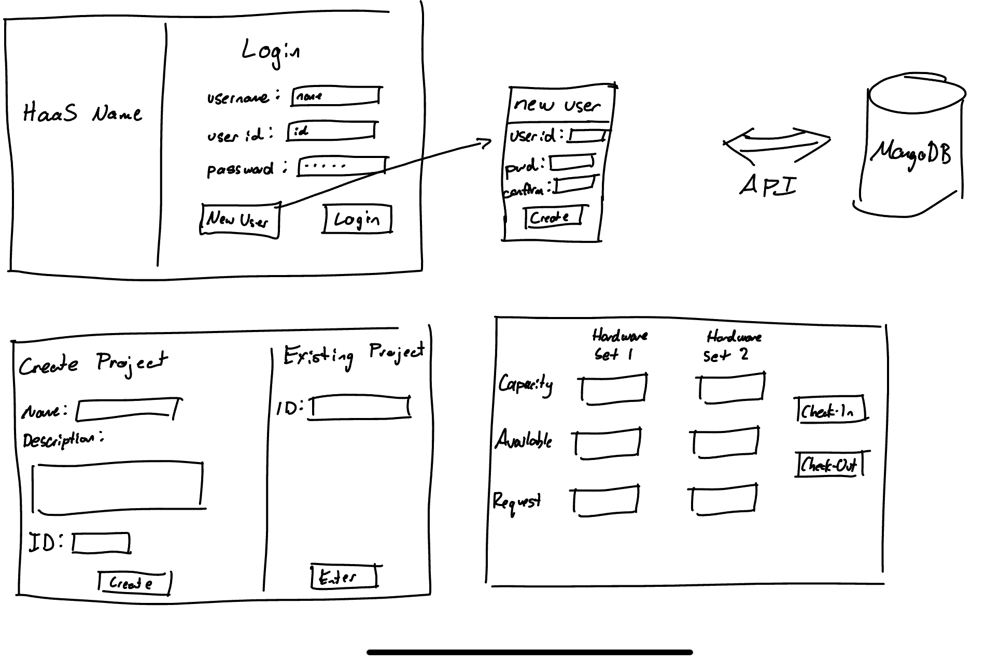

# Checkpoint 1

### Safin Rashid, Kashif Bandali, Josh Valinsky, Harsha Jandhyala

We want to create a Hardware-as-a-Service (HaaS) platform that allows users to use hardware resources and pay for the duration of their usage. This platform will offer account creation options to provide users with a personalized experience on the website, have the capability to initiate projects, and link them to various available hardware configurations. 

## Project Summary and Plan

### User Management:

a. Create a sign-in page where users can enter their user name, user ID, and password.

b. Implement a "New User" functionality that displays a pop-up to enter a new user ID and password.

c. Develop a section for creating new projects, including fields for project name, description, and project ID.

d. Create a section where users can log in to existing projects.

e. Implement a database, MongoDB, to store user information and project details.

f. Create an API to access user and project information stored in the database.

g. Implement AES-256 to encrypt user IDs and passwords.

### Resource Management:

a. Develop a display area that shows the capacity of HWSet1 and HWSet2.

b. Create a display area that shows the availability of HWSet1 and HWSet2.

c. Implement a database to store hardware resource information.

d. Create a display area where users can specify how many units of HWSet1 and HWSet2 they want to check out and later check in.

### System Requirements:

a. Ensure the PoC is delivered within budget and schedule constraints, with periodic updates to stakeholders. Use an Agile development approach.

b. Develop a front-end web application using React.js that allows users to enter inputs and view outputs.

c. Implement AES-256 encryption for encrypting user IDs and passwords using Python cryptographic modules.

d. Develop a mechanism for creating or accessing new projects using Python object-oriented programming (OOP) and modules.

e. Create a database for maintaining user login credentials, project codes, project details, and resource details using MongoDB.

f. Map each system requirement to one or more stakeholder needs to ensure that all stakeholder needs are met.

## User Stories

We plan to use the built-in GitHub 'Project' tool in this repository to organize work items and user stories effectively in one spot integrated with the repository and respective pull requests, initially populated with stores, technical debt, and research.

## Sketches

## Tools

Backend: Python
Frontend: React
Database: MongoDB
Deployment: Google Cloud (student free credits)
Environment Management: Docker
Version control: GitHub
